# Repository maps

[← Visual assets](../README.md) · [Documentation home](../../README.md) · [Architecture](../../maintainers/engineering/architecture.md) · [Diagram source](source.md)

European Tech Opportunities 2027 turns permission-gated public listing evidence into a validated directory. **SQLite owns the lifecycle; the website, API, downloads, and README only present it.**

Inspired by [GitDiagram](https://github.com/ahmedkhaleel2004/gitdiagram): colored subsystem groups, labeled connections, database shapes, and clickable links to the implementation. This is a map of the current working tree, not a diagram generated from production data.

## Choose a view

| View | Question it answers |
|---|---|
| [Repository overview](#repository-overview) | How does the whole system fit together? |
| [Collection and lifecycle](#collection-and-lifecycle) | How does evidence become an accepted listing? |
| [Website and publication](#website-and-publication) | What reaches users, and what stays in their browser? |
| [Automation and deployment](#automation-and-deployment) | How does reviewed state reach production safely? |
| [Testing, documentation, and tooling](#testing-documentation-and-tooling) | What builds, verifies, documents, and protects the project? |
| [Editable Mermaid source](source.md) | Where do I change or reuse these diagrams? |

**Viewing:** open an SVG directly in your browser to zoom and follow its code links. On GitHub, use the raw/download view; embedded image previews may disable node links. The SVGs work without JavaScript, a diagram service, API keys, or external resources. Code links open GitHub only when selected and target `main`; unmerged paths become available there after merging.

**Legend:** solid arrows carry data, evidence, or artifacts; dashed arrows mean “runs,” “configures,” or “supports.” Cylinders represent stored data; the hexagon identifies the controlled application writer. Grouped boxes are ownership boundaries, not necessarily separate services. Python paths are relative to `src/opportunities/` unless shown in full.

## Repository overview

[Open the full-size repository map](svg/repository.svg)

Read the main path as **configure → collect → classify → persist → publish**.
Search definitions and acceptance rules tell the CLI where to look and what evidence is required.
The Python pipeline fetches permitted guest HTML, normalizes listings, and applies deterministic checks.
Only `Repository` writes application lifecycle state, keeping jobs, provenance, and run history in SQLite.
The website, API, downloads, and bounded README present that state; production readers use verified releases.
Browser-local lists sit beside the public data flow and never write back to the database.
The surrounding groups show the automation, tests, documentation, policies, and build tools supporting these boundaries.

## Collection and lifecycle

[Open the collection map](svg/collection.svg) · [Acceptance policy](../../maintainers/engineering/classification.md) · [Lifecycle details](../../maintainers/operations/database.md)

Search YAML defines discovery scope; classification rules define publication eligibility.
The CLI supplies validated settings to a runner that bounds concurrency and isolates each search.
Permission-gated HTTP provides search cards and identity-validated details, with company/title prefilters first.
Normalization and classification check role type, seniority, technology, cycle/date, and European location.
Successful searches commit independently; failed searches save diagnostics without changing listing lifecycle state.
Missing cards cannot close jobs: known-ID rechecks need explicit `404`/`410` confirmations and no active association.
The separate availability audit keeps/reopens valid listings, deletes explicitly unavailable ones, and preserves uncertainty.
Reviewed offline additions reuse acceptance checks and repository transactions, without invented provenance or manual reopening.

## Website and publication

[Open the publication map](svg/website.svg) · [Website contract](../../maintainers/engineering/website.md) · [Public data](../../users/data/data.md)

SQLite feeds two publication paths: Python-generated files and server-only website queries.
Python owns the README preview, full-state review seal, sanitized CSV/JSON, and dataset metadata.
The Next.js page and v1 API share a read-only query; download routes only serve existing export files.
In versioned mode, each server operation selects one release before opening its database or downloads.
React components handle search, filters, sorting, pagination, and theme without changing canonical data.
Saved/applied/hidden IDs and visit times stay in localStorage, never SQLite, shared URLs, the API, or analytics.
Schema, link-validation, and metadata helpers keep the public output predictable and safe to consume.

## Automation and deployment

[Open the operations map](svg/automation.svg) · [Canonical automation guide](../../maintainers/operations/automation.md)

Scheduled and manual workflows serialize canonical updates through a shared one-writer lock.
The protected processor restores verified state, checks its review seal, migrates, and runs selected CLI phases.
After projection validation and checkpointing, it publishes and restore-verifies a restricted SQLite snapshot.
A separate job receives only the README, opens a narrowly scoped pull request, and waits for validation.
**Merging the matching README does not deploy:** publication is a separate protected manual run.
Deployment verifies payloads under a lock and switches the release pointer atomically, retaining old releases for readers.
Canonical databases and snapshot manifests never enter public GitHub caches or artifacts.
Recovery modes differ: the normal drill publishes a verified snapshot; seal adoption proposes only the README baseline.

## Testing, documentation, and tooling

[Open the foundations map](svg/foundations.svg) · [Testing guide](../../maintainers/engineering/testing.md) · [Documentation ownership](../../maintainers/engineering/documentation.md)

These groups explain how the repository is built and checked without accessing live listing data.
Frozen Python and Bun dependencies provide consistent linting, typing, unit tests, and browser tooling.
Domain models, shared utilities, migrations, and public schemas define the contracts those checks protect.
Offline fixtures and synthetic SQLite/exports drive integration, browser, accessibility, and privacy tests.
CI adds container smoke tests and security checks; normal validation never collects LinkedIn listings.
Documentation and sanitized visuals use a separate allowlisted build, publishing to GitHub Pages only from `main`.
Coverage and registry summaries come from their owning tools, while policies and contribution controls guide review.

## Repository coverage

Repeated search definitions, tests, and small UI primitives are grouped so the maps stay readable. Together these views cover the maintained repository at subsystem level, not every file or import.

| Area | Included responsibilities |
|---|---|
| `configs/` | Company/country/role searches, categories, example settings |
| `src/opportunities/cli/`, `config/` | Entry point, commands, settings, search registry, rules, cycle policy |
| `src/opportunities/scrapers/` | Bounded HTTP transport and LinkedIn guest parsing |
| `src/opportunities/normalization/`, `pipeline/` | Title/location normalization, acceptance, collection, availability |
| `src/opportunities/models/`, `utils/` | Typed records/enums; concurrency, atomic files, paths, time, text, URL, logging |
| `src/opportunities/database/`, `migrations/`, `alembic.ini` | Repository, SQLAlchemy models/sessions, schema history, verified snapshots |
| Python projection modules | `readme.py`, `public_exports.py`, `search_registry_docs.py` |
| `schemas/` | Public v1 schema and sanitized contract examples |
| `site/src/app/`, `components/`, `lib/`, `types/` | Routes, directory UI, theme/layout, server queries, browser state, helpers, metadata |
| `site/scripts/`, site configuration | Standalone startup, synthetic demo recording, Next.js/security headers, browser/Lighthouse tooling |
| `tests/`, `site/tests/`, `scripts/testing/` | Unit/integration/benchmark coverage, fixtures, synthetic state, browser accessibility and privacy checks |
| `scripts/database/`, `scripts/deployment/` | Migration checks, backup/bootstrap/recovery, snapshot transfer, locked release activation |
| `.github/` | Workflows, shared Python setup action, issue/PR templates, owners, Dependabot, prose rules |
| `docs/`, `scripts/docs/`, `mkdocs.yml` | User/maintainer guides, visual assets, link/lint/build checks, coverage documentation, Pages |
| Root tooling and policies | Python/Bun manifests and locks, Makefile, Docker/Compose, ignore/lint settings, contribution/security/privacy/community/license rules |
| `data/` | Ignored runtime SQLite, generated exports, and versioned release files; shown conceptually, never read or included in these assets |

Vendored dependencies, build outputs, caches, local logs, secrets, private databases, and personal `.context/` or `.agents/skills/` content are intentionally excluded.

## Maintain the maps

Edit the relevant block in [source.md](source.md), then regenerate its SVG using the [rendering profile](source.md#rendering-profile). The five SVGs in `svg/` are rendered artifacts of that source; the README and editable source stay at this folder's root. Keep diagram source and rendered SVGs in this folder; changes to product-showcase media follow the separate [asset guide](../README.md).

Check Mermaid parsing, code-link targets, text containment, SVG accessibility labels, and readability at both preview and full size. Include group headings in overlap checks: they must clear the first component box and remain inside their group. SVGs must remain self-contained: no scripts, HTML labels, embedded credentials, or runtime data. The canonical [architecture](../../maintainers/engineering/architecture.md), [security policy](../../../SECURITY.md), and linked maintainer guides remain authoritative if implementation changes make a map stale.
