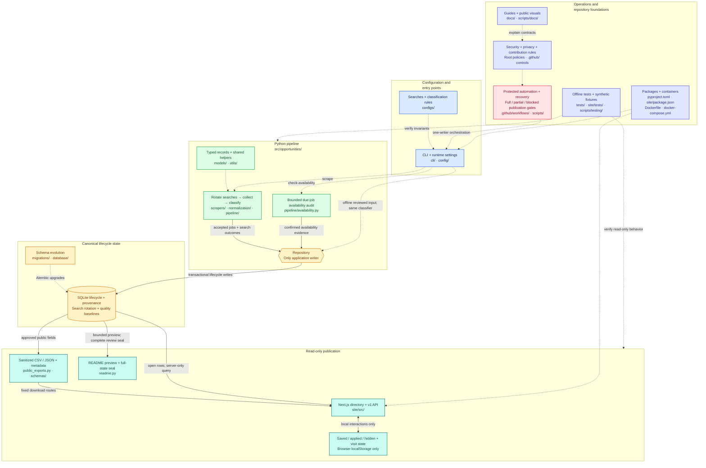
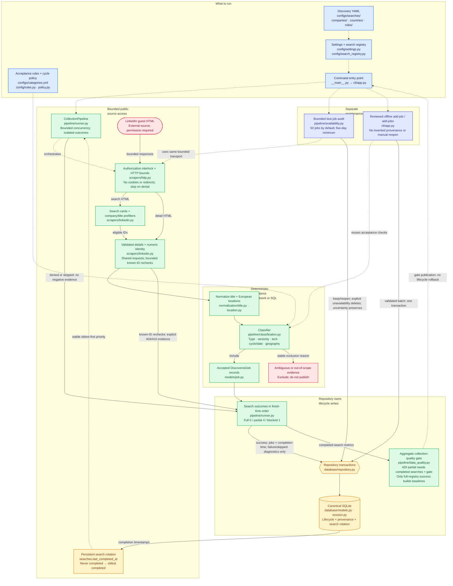
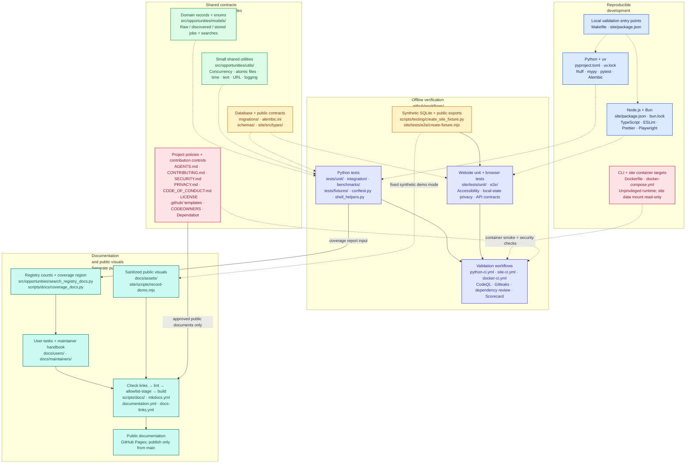

# Diagram source

[← Repository maps](README.md) · [Visual assets](../README.md) · [Rendering profile](#rendering-profile)

This file owns the five SVGs in `svg/`: their labels, relationships, accessibility descriptions, and rendering configuration. Use the [annotated maps](README.md) to explore the architecture and the [rendering profile](#rendering-profile) to regenerate assets after a source change.

The colors, grouped components, directed relationships, and clickable code links follow [GitDiagram's](https://github.com/ahmedkhaleel2004/gitdiagram) visual approach. Solid arrows carry data or artifacts; dashed arrows indicate configuration, orchestration, or a supporting dependency. These are subsystem maps, not exhaustive import graphs.

## Repository overview



## Collection and lifecycle



## Website and publication

```mermaid
flowchart TB
    accTitle: Website and publication — read-only server, private browser state
    accDescr: SQLite supplies open rows to Python projection renderers and to a server-only Next.js query shared by the page and public API. The website serves fixed generated download files; it does not create them. Browser-local lists never enter the database, URLs, API, or analytics. In versioned deployment mode each server operation resolves the release pointer once.

    subgraph DATA["Publication inputs"]
        DB[("Canonical SQLite<br/>Open jobs + last successful collection")]
        RELEASE["Versioned release selection<br/>site/src/lib/release-path.ts<br/>Resolve current once per operation"]
        SCHEMA["Public v1 contracts + examples<br/>schemas/"]
    end

    subgraph PYTHON["Python-generated<br/>projections<br/>src/opportunities/"]
        RENDER["Bounded preview + full-state review seal<br/>readme.py"]
        README["README.md<br/>At most five newest jobs per type"]
        EXPORT["Allowlisted fields + spreadsheet-safe CSV<br/>public_exports.py"]
        FILES["Generated CSV / JSON + metadata<br/>data/exports/ · ignored runtime files"]
        RENDER --> README
        EXPORT --> FILES
    end

    subgraph SERVER["Next.js server<br/>No canonical writes"]
        QUERY["Shared read-only SQLite query<br/>site/src/lib/opportunities.ts<br/>node:sqlite · readOnly: true"]
        PAGE["Directory page + layout<br/>site/src/app/page.tsx · layout.tsx"]
        API["GET /api/v1/opportunities<br/>app/api/v1/opportunities/route.ts<br/>lib/opportunity-api.ts"]
        DOWNLOAD["Fixed CSV / JSON / metadata routes<br/>site/src/lib/public-export.ts"]
        SCHEMAROUTE["GET /schemas/opportunities-v1.schema.json<br/>site/src/app/schemas/"]
        SEO["Metadata + sitemap + robots + JSON-LD<br/>app/ · lib/structured-data.ts<br/>lib/site-url.ts · site-config.ts"]
        QUERY --> PAGE
        QUERY -->|bounded query; explicit public fields| API
        SEO -.-> PAGE
    end

    subgraph BROWSER["React browser<br/>interaction · site/src/"]
        DIRECTORY["Opportunity directory<br/>components/opportunities/<br/>Table · filters · sorting · pagination"]
        HELPERS["URL + presentation helpers<br/>lib/opportunity-filter.ts · opportunity-sort.ts<br/>opportunity-presentation.ts · listing-url.ts"]
        UI["Shared UI + theme + layout<br/>components/ui/ · theme/ · layout/<br/>types/ · app/globals.css"]
        LISTS["Local list parsing + synchronization<br/>lib/local-opportunity-state.ts<br/>use-local-opportunities.ts"]
        STORAGE[("Browser localStorage<br/>Saved / applied / hidden IDs + visit times<br/>Never sent to server or analytics")]
        ANALYTICS(["Production-only Umami integration<br/>Not connected to private lists"])
        HELPERS -.-> DIRECTORY
        UI -.-> DIRECTORY
        DIRECTORY <-->|browser actions| LISTS
        LISTS <--> STORAGE
    end

    DB --> RENDER
    DB --> EXPORT
    DB --> QUERY
    RELEASE -.->|select database| QUERY
    RELEASE -.->|select export directory| DOWNLOAD
    SCHEMA -.->|validate exports| EXPORT
    SCHEMA --> SCHEMAROUTE
    FILES -->|serve existing bytes| DOWNLOAD
    PAGE -->|public rows as props| DIRECTORY
    PAGE -.->|production origin only| ANALYTICS

    click DB "https://github.com/simonesiega/european-tech-opportunities-2027/blob/main/src/opportunities/database/models.py"
    click RELEASE "https://github.com/simonesiega/european-tech-opportunities-2027/blob/main/site/src/lib/release-path.ts"
    click SCHEMA "https://github.com/simonesiega/european-tech-opportunities-2027/tree/main/schemas"
    click RENDER "https://github.com/simonesiega/european-tech-opportunities-2027/blob/main/src/opportunities/readme.py"
    click README "https://github.com/simonesiega/european-tech-opportunities-2027/blob/main/README.md"
    click EXPORT "https://github.com/simonesiega/european-tech-opportunities-2027/blob/main/src/opportunities/public_exports.py"
    click FILES "https://github.com/simonesiega/european-tech-opportunities-2027/blob/main/docs/users/data/data.md"
    click QUERY "https://github.com/simonesiega/european-tech-opportunities-2027/blob/main/site/src/lib/opportunities.ts"
    click PAGE "https://github.com/simonesiega/european-tech-opportunities-2027/blob/main/site/src/app/page.tsx"
    click API "https://github.com/simonesiega/european-tech-opportunities-2027/blob/main/site/src/app/api/v1/opportunities/route.ts"
    click DOWNLOAD "https://github.com/simonesiega/european-tech-opportunities-2027/blob/main/site/src/lib/public-export.ts"
    click SCHEMAROUTE "https://github.com/simonesiega/european-tech-opportunities-2027/tree/main/site/src/app/schemas"
    click SEO "https://github.com/simonesiega/european-tech-opportunities-2027/blob/main/site/src/lib/structured-data.ts"
    click DIRECTORY "https://github.com/simonesiega/european-tech-opportunities-2027/tree/main/site/src/components/opportunities"
    click HELPERS "https://github.com/simonesiega/european-tech-opportunities-2027/tree/main/site/src/lib"
    click UI "https://github.com/simonesiega/european-tech-opportunities-2027/tree/main/site/src/components"
    click LISTS "https://github.com/simonesiega/european-tech-opportunities-2027/blob/main/site/src/components/opportunities/use-local-opportunities.ts"
    click STORAGE "https://github.com/simonesiega/european-tech-opportunities-2027/blob/main/site/src/lib/local-opportunity-state.ts"
    click ANALYTICS "https://github.com/simonesiega/european-tech-opportunities-2027/blob/main/site/src/app/layout.tsx"

    classDef blue fill:#dbeafe,stroke:#2563eb,stroke-width:1.5px,color:#172554
    classDef mint fill:#dcfce7,stroke:#16a34a,stroke-width:1.5px,color:#14532d
    classDef amber fill:#fef3c7,stroke:#d97706,stroke-width:1.5px,color:#78350f
    classDef teal fill:#ccfbf1,stroke:#0f766e,stroke-width:1.5px,color:#134e4a
    classDef rose fill:#ffe4e6,stroke:#e11d48,stroke-width:1.5px,color:#881337
    classDef indigo fill:#e0e7ff,stroke:#4f46e5,stroke-width:1.5px,color:#312e81
    class DB,RELEASE amber
    class SCHEMA,SEO indigo
    class RENDER,EXPORT mint
    class README,FILES,QUERY,PAGE,API,DOWNLOAD,SCHEMAROUTE teal
    class DIRECTORY,HELPERS,UI,LISTS,STORAGE blue
    class ANALYTICS rose
```



## Automation and deployment

```mermaid
flowchart TB
    accTitle: Automation and deployment — protected state, reviewed publication
    accDescr: Scheduled or manual workflows serialize canonical operations through a shared writer lock. The reusable processor restores verified state, migrates, requires the reviewed README to match, and executes selected CLI phases. Full or eligible partial collection, including HTTP 429 partial results, must pass quality, SQLite integrity, projection, and snapshot checks. Other source denials, all audit denials, and failed validation block publication. Scheduling progress travels only with verified SQLite snapshots. A separate job receives only the README: full nightly collections retain automatic merging after checks, while partial proposals require manual review and merge. Unmerged or rejected state blocks subsequent ordinary mutations and deployment.

    subgraph TRIGGERS["Operator-facing<br/>workflows<br/>.github/workflows/"]
        NIGHTLY["nightly.yml<br/>Availability audit → scrape"]
        MANUAL["scrape.yml · check-availability.yml<br/>add-job.yml<br/>Explicitly selected dataset updates"]
    end

    subgraph PROCESS["Protected canonical<br/>processing<br/>One shared writer lock"]
        RESTORE["Verify + restore durable state<br/>scripts/database/<br/>restore_canonical_state.sh · bootstrap_sqlite.py"]
        PROCESSOR["reusable-process-state.yml<br/>Migrate → require matching reviewed README<br/>Selected CLI phases; source stops on denial"]
        GATES{"Publication eligibility + validation<br/>Full or partial with completed searches<br/>429 may qualify; other source/audit denials block<br/>Quality + SQLite integrity + projections"}
        BLOCKED["Blocking failure: no publication<br/>Audit denial; other source denial; no success<br/>Failed quality, integrity, or projection checks"]
        SNAPSHOTS["Create / publish / round-trip verify<br/>database/snapshots.py<br/>scripts/database/canonical_snapshot.py<br/>canonical_state_store.sh"]
        STORE[("Restricted VPS snapshot store<br/>Immutable SQLite + manifests<br/>Verified latest pointer")]
        RESTORE --> PROCESSOR
        PROCESSOR --> GATES
        GATES -->|eligible full or partial; checkpoint| SNAPSHOTS
        GATES -->|reject| BLOCKED
        SNAPSHOTS --> STORE
    end

    subgraph REVIEW["GitHub review handoff<br/>No database or<br/>VPS credentials"]
        HANDOFF["README-only handoff + outcome output<br/>Sanitized exports + aggregate quality report<br/>No SQLite or manifests in artifacts"]
        PR["reusable-readme-pr.yml<br/>README-only pull request<br/>Dispatch and await validation workflows"]
        MERGED["Matching README + full-state seal in main<br/>Full nightly: existing automatic-merge policy<br/>Partial: manual review and merge required"]
        HANDOFF --> PR --> MERGED
    end

    subgraph DEPLOYMENT["Separate manual<br/>deployment<br/>Protected production<br/>environment"]
        DEPLOY["scrape.yml with deployment mode<br/>Restore reviewed state; no source access<br/>Validate → snapshot → upload"]
        ACTIVATE["scripts/deployment/<br/>deploy_canonical_state.sh<br/>activate_canonical_release.sh<br/>Lock + checksums + atomic pointer switch"]
        RELEASE[("Immutable release<br/>SQLite + CSV / JSON + metadata<br/>data/current → releases/run-attempt")]
        SITE["Read-only Next.js readers<br/>site/src/lib/release-path.ts<br/>Old releases retained for in-flight readers"]
        DEPLOY --> ACTIVATE --> RELEASE --> SITE
    end

    NIGHTLY -.-> RESTORE
    MANUAL -.-> RESTORE
    SNAPSHOTS -->|only after verified publication| HANDOFF
    MERGED -.->|required review; does not auto-deploy| DEPLOY
    STORE -->|verified restore| DEPLOY

    click NIGHTLY "https://github.com/simonesiega/european-tech-opportunities-2027/blob/main/.github/workflows/nightly.yml"
    click MANUAL "https://github.com/simonesiega/european-tech-opportunities-2027/blob/main/.github/WORKFLOWS.md"
    click RESTORE "https://github.com/simonesiega/european-tech-opportunities-2027/blob/main/scripts/database/restore_canonical_state.sh"
    click PROCESSOR "https://github.com/simonesiega/european-tech-opportunities-2027/blob/main/.github/workflows/reusable-process-state.yml"
    click GATES "https://github.com/simonesiega/european-tech-opportunities-2027/blob/main/.github/workflows/reusable-process-state.yml"
    click BLOCKED "https://github.com/simonesiega/european-tech-opportunities-2027/blob/main/docs/maintainers/operations/automation.md"
    click SNAPSHOTS "https://github.com/simonesiega/european-tech-opportunities-2027/blob/main/src/opportunities/database/snapshots.py"
    click STORE "https://github.com/simonesiega/european-tech-opportunities-2027/blob/main/scripts/database/canonical_state_store.sh"
    click HANDOFF "https://github.com/simonesiega/european-tech-opportunities-2027/blob/main/.github/workflows/reusable-process-state.yml"
    click PR "https://github.com/simonesiega/european-tech-opportunities-2027/blob/main/.github/workflows/reusable-readme-pr.yml"
    click MERGED "https://github.com/simonesiega/european-tech-opportunities-2027/blob/main/README.md"
    click DEPLOY "https://github.com/simonesiega/european-tech-opportunities-2027/blob/main/.github/workflows/scrape.yml"
    click ACTIVATE "https://github.com/simonesiega/european-tech-opportunities-2027/tree/main/scripts/deployment"
    click RELEASE "https://github.com/simonesiega/european-tech-opportunities-2027/blob/main/docs/maintainers/operations/automation.md"
    click SITE "https://github.com/simonesiega/european-tech-opportunities-2027/blob/main/site/src/lib/release-path.ts"

    classDef blue fill:#dbeafe,stroke:#2563eb,stroke-width:1.5px,color:#172554
    classDef amber fill:#fef3c7,stroke:#d97706,stroke-width:1.5px,color:#78350f
    classDef teal fill:#ccfbf1,stroke:#0f766e,stroke-width:1.5px,color:#134e4a
    classDef rose fill:#ffe4e6,stroke:#e11d48,stroke-width:1.5px,color:#881337
    classDef indigo fill:#e0e7ff,stroke:#4f46e5,stroke-width:1.5px,color:#312e81
    class NIGHTLY,MANUAL blue
    class RESTORE,PROCESSOR,GATES,SNAPSHOTS,STORE amber
    class BLOCKED rose
    class HANDOFF,PR,MERGED indigo
    class DEPLOY,ACTIVATE rose
    class RELEASE,SITE teal
```



The diagram traces dataset updates and deployment. `canonical-state-drill.yml` reuses the processor for recovery verification without source access; its normal mode publishes a verified snapshot without a README PR. Its one-time seal-adoption mode and its separate README-recovery mode instead propose README-only PRs without snapshot publication or deployment. Verified snapshots, including search-rotation timestamps, are also the normal input to the next update's restore step; that feedback arrow is omitted for readability. An unmerged or rejected partial proposal does not authorize another update: the reviewed-state barrier still stops ordinary mutation and deployment. Snapshot-verification failure prevents the README handoff; scheduling metadata is never restored separately from its database.

## Testing, documentation, and tooling



## Rendering profile

The committed assets use Mermaid 11.12.0 and the ELK layout loader 0.1.7. Register the ELK loader before rendering, or use a Mermaid renderer with ELK support. Render the five blocks into `svg/` in order as `repository.svg`, `collection.svg`, `website.svg`, `automation.svg`, and `foundations.svg`. Invisible `~~~` links only control placement; they do not add architectural relationships.

Keep the explicit `<br/>` breaks in group headings: Mermaid's cluster renderer wraps headings more narrowly than ELK's initial label measurement. Short, explicit lines let ELK reserve their full height, preventing headings from overlapping the first component box. After rendering, check group headings against component boxes as well as node and edge labels.

Use this shared configuration, a white SVG background, and system fonts. Retain the accessibility titles/descriptions and HTTPS code links. Do not embed scripts, external resources, or HTML labels in the exported SVGs.

Mermaid's strict mode does not activate `click` directives. For the standalone export, use the explicit node-to-URL mappings in each block to wrap each corresponding node in one native SVG link after rendering. Keep `securityLevel: "strict"`; do not enable JavaScript callbacks or a looser rendering mode to restore links. Each link needs its HTTPS `href`, `target="_blank"`, `rel="noopener noreferrer"`, an accessible name, and `tabindex="0"` for explicit keyboard focus. Separate label lines with spaces in the accessible name. Check for nested anchors, unexpected URLs, scripts, and network requests when opening the exported file.

```json
{
  "layout": "elk",
  "elk": {
    "mergeEdges": false,
    "nodePlacementStrategy": "NETWORK_SIMPLEX"
  },
  "startOnLoad": false,
  "securityLevel": "strict",
  "theme": "base",
  "look": "classic",
  "htmlLabels": false,
  "deterministicIds": true,
  "deterministicIDSeed": "european-tech-opportunities-2027",
  "flowchart": {
    "htmlLabels": false,
    "curve": "linear",
    "nodeSpacing": 35,
    "rankSpacing": 55,
    "padding": 18,
    "wrappingWidth": 340,
    "subGraphTitleMargin": { "top": 8, "bottom": 24 }
  },
  "themeVariables": {
    "fontFamily": "Segoe UI, Arial, sans-serif",
    "fontSize": "18px",
    "background": "#ffffff",
    "primaryColor": "#f8fafc",
    "primaryTextColor": "#0f172a",
    "primaryBorderColor": "#64748b",
    "lineColor": "#475569",
    "clusterBkg": "#f8fafc",
    "clusterBorder": "#cbd5e1",
    "edgeLabelBackground": "#ffffff",
    "tertiaryColor": "#f8fafc"
  },
  "themeCSS": ".cluster rect { rx: 10px; ry: 10px; } .cluster-label text { font-weight: 600; } .node rect { rx: 6px; ry: 6px; } .edgeLabel text { font-size: 15px; } a:hover .label-container, a:focus .label-container { stroke-width: 3px; }"
}
```

### Refresh native link accessibility

After adding native SVG links, run this from the repository root to set their accessible names and keyboard focus from the Mermaid node labels. It requires the existing links to match the source mappings and changes only anchor attributes, not rendered geometry. If labels, relationships, or layout changed, render with Mermaid first; this step alone cannot update the drawing.

```bash
uv run --frozen python - <<'PY'
import html
import re
from pathlib import Path

root = Path("docs/assets/diagram")
blocks = re.findall(r"```mermaid\n(.*?)\n```", (root / "source.md").read_text(encoding="utf-8"), re.S)
names = ("repository", "collection", "website", "automation", "foundations")
outputs = []
for name, block in zip(names, blocks, strict=True):
    links = dict(re.findall(r'click (\w+) "([^"]+)"', block))
    labels = dict(re.findall(r'^\s*(\w+)[\[({]+"([^"\n]+)"', block, re.M))
    seen = []

    def refresh(match):
        tag = match.group()
        node = match.group(1)
        url = html.unescape(re.search(r'\shref\s*=\s*"([^"]+)"', tag).group(1))
        if url != links[node]:
            raise ValueError(f"Unexpected SVG link for {node}: {name}")
        label = labels[node].replace("<br/>", " ")
        seen.append(node)
        tag = re.sub(r'\s(?:aria-label|tabindex)="[^"]*"', "", tag)
        accessible_name = html.escape(label + " — open source on GitHub", quote=True)
        return tag[:-1] + f' tabindex="0" aria-label="{accessible_name}">'

    path = root / "svg" / f"{name}.svg"
    anchor = r'<a\s[^>]*>(?=\s*<g\s[^>]*\bid="flowchart-(\w+)-\d+"[^>]*>)'
    updated = re.sub(anchor, refresh, path.read_text(encoding="utf-8"))
    if sorted(seen) != sorted(links):
        raise ValueError(f"SVG links do not match Mermaid source: {name}")
    outputs.append((path, updated))

for path, updated in outputs:
    path.write_text(updated, encoding="utf-8", newline="\n")
PY
```

Verify all links are reachable with Tab and show a visible focus indicator. Open a link with Enter only when external navigation is intended.
