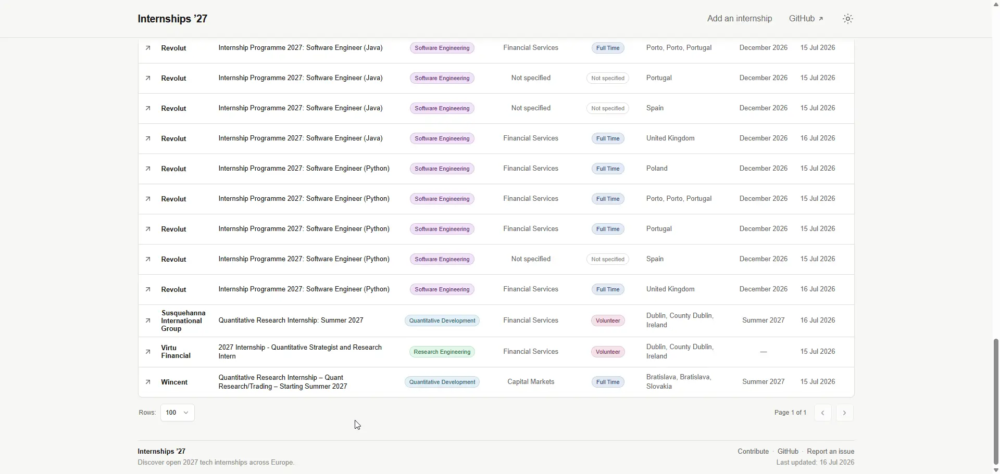
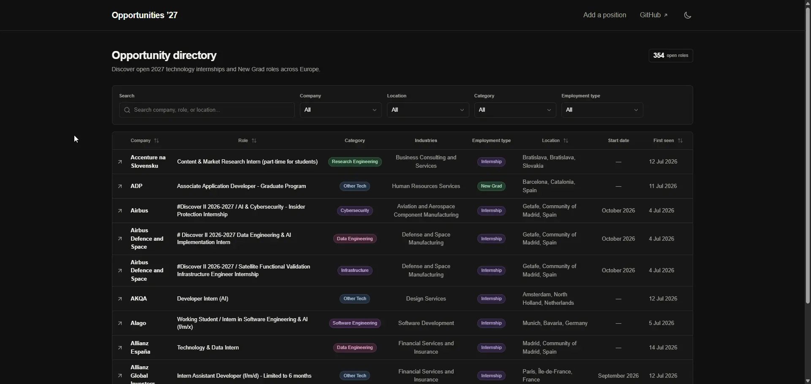

# European Tech Internships 2027 Website Guide

[← Documentation](../README.md) · [Open the live site](https://internship2027.simonesiega.com/)

The [live website](https://internship2027.simonesiega.com/) is the project’s primary public interface. It displays every currently open internship and New Grad position in canonical SQLite state, while the root README intentionally shows bounded previews for both types.

## Contents

- [Interface](#interface)
- [Search, filters, and sorting](#search-filters-and-sorting)
- [Displayed fields](#displayed-fields)
- [Data interpretation](#data-interpretation)
- [Accessibility and responsive behavior](#accessibility-and-responsive-behavior)
- [Shareable filter URLs](#shareable-filter-urls)
- [Search and social metadata](#search-and-social-metadata)
- [Read-only database contract](#read-only-database-contract)
- [Local website development](#local-website-development)
- [Production runtime](#production-runtime)
- [Data refresh](#data-refresh)
- [Privacy and future integrations](#privacy-and-future-integrations)

## Interface

<p align="center">
  
  
</p>

The directory provides:

- free-text search;
- company, country, technology-category, and employment-type filters;
- sortable columns;
- pagination with selectable page size;
- light and dark themes stored as browser preferences;
- direct links to public source listings;
- shareable filter URLs;
- the current open-role count;
- the latest completed collection time.

The website supports browsing and comparison only. Applications are completed through the original employer or LinkedIn listing.

## Search, filters, and sorting

Free-text search covers:

- company;
- role title;
- technology category;
- industries;
- employment type;
- location.

Filters can be combined by:

- company;
- country;
- technology category;
- employment type, using a single-select choice of Internship or New Grad.

Sortable columns include:

- company;
- role;
- location;
- first-seen date.

Search, filtering, sorting, page size, and pagination affect only the displayed result set. They never mutate canonical state or influence collection.

Search and filter state is encoded in the URL so a filtered view can be bookmarked or shared. Sorting, page size, and pagination remain local presentation state.

A browser interaction or URL state is not lifecycle evidence, collection input, or a pipeline instruction.

## Displayed fields

| Column | Source and behavior |
|---|---|
| Company | LinkedIn detail heading, with search-card fallback |
| Role | Normalized detail title, with search-card fallback |
| Category | Deterministic internal technology classification |
| Industries | Structured LinkedIn `Industries` criterion |
| Employment type | Deterministic title classification; always `Internship` or `New Grad` |
| Location | Normalized explicit detail or search-card location |
| Start date | Explicit month or season plus year from title or narrow start-date context |
| First seen | First accepted observation in canonical SQLite state |

The website renders normalized publication fields rather than raw source HTML.

External application links must remain validated public HTTPS URLs.

## Data interpretation

`Not specified` means that optional structured metadata such as industries was absent, unsupported, or not accepted by the parser. Employment type is required for every published row.

The project does not infer structured values from arbitrary description keywords merely to fill missing cells.

The website does not claim:

- application eligibility;
- visa sponsorship;
- compensation;
- remote-work eligibility;
- application deadlines;
- continued availability beyond the source listing;
- complete coverage of European technology internships.

Verify role requirements, location, deadline, compensation, work authorization, and current availability on the original listing before applying.

`First seen` is the first time the pipeline accepted a listing. It is not necessarily the employer’s publication date.

A listing may disappear from search results without being marked closed. Closure follows the explicit lifecycle rules in [Database lifecycle](../operations/database.md#closure-lifecycle).

## Accessibility and responsive behavior

Website changes should preserve:

- semantic headings, landmarks, tables, labels, and controls;
- keyboard access to interactive elements;
- visible focus behavior;
- meaningful link and button text;
- readable light and dark themes;
- responsive layouts for desktop, tablet, and mobile widths;
- usable empty, loading, and no-result states;
- stable search, filter, sort, and pagination behavior.

The empty directory is a valid state when the configured database contains no open listings.

## Shareable filter URLs

The directory recognizes these query parameters:

| Parameter | Meaning |
|---|---|
| `q` | Free-text search |
| `company` | Exact company option |
| `country` | Exact country option |
| `category` | Exact internal technology category |
| `type` | Exact normalized employment type: `internship` or `new-grad` |

For example:

```text
https://internship2027.simonesiega.com/?q=security&country=Germany
```

Selecting a filter adds it to browser history, clearing a filter removes its parameter, and browser back/forward navigation restores earlier filter selections. Search typing replaces the current history entry to avoid creating one entry per keystroke. Reset removes only directory-owned parameters.

A company, country, category, or employment-type value that is not present in the current open dataset is ignored. Query parameters are untrusted presentation input and never reach a database write path.

## Search and social metadata

The website publishes:

- a canonical URL that excludes transient filter parameters;
- descriptive title, description, authorship, and crawler directives;
- Open Graph and large-card social metadata;
- a generated 1200 × 630 social preview image;
- `/robots.txt`, `/sitemap.xml`, and `/manifest.webmanifest` metadata routes.

`SITE_URL` must contain the canonical public origin so absolute metadata, sitemap, and crawler URLs are correct in production.

## Read-only database contract

Website database access lives under:

```text
site/src/lib/
```

`site/src/lib/internships.ts` opens SQLite in read-only mode and queries currently open jobs in stable publication order.

It also reads the latest completed collection timestamp from `search_runs` for public status metadata.

Each server request uses a short-lived database connection that is then closed.

The website:

- never runs migrations;
- never inserts, updates, closes, or reopens jobs;
- never performs LinkedIn requests;
- never treats browser activity as canonical state;
- never exposes a mutation API;
- observes a newly deployed database on the next request.

The Python pipeline is the sole application writer.

Authentication, user-provided content, saved application state, write endpoints, or administrative mutation interfaces require an explicit architecture and security decision before implementation.

## Local website development

A fresh local database may contain no listings, and the website must render that state correctly.

For installation, database initialization, environment-file creation, and first launch, use [Installation](../getting-started/installation.md#run-the-website).

Website runtime variables are documented in [Configuration](../getting-started/configuration.md#website-settings). Components use Tailwind CSS utility classes; `site/src/app/globals.css` owns only the Tailwind import, shared design tokens, theme selectors, and base document rules.

Install the Playwright Chromium browser once, then run the complete website checks:

```bash
cd site
bunx playwright install chromium
bun run ci
```

`bun run ci` checks formatting, lint, strict TypeScript, the production build, and offline Playwright behavior against a generated temporary SQLite fixture. It does not contact LinkedIn.

The complete validation path and coding expectations are documented in [Development](../development/development.md#website-validation).

## Production runtime

The root Dockerfile’s `site` target:

1. installs dependencies from the frozen Bun lockfile;
2. builds Next.js standalone output under Node 26;
3. copies only required standalone and static output into the final image;
4. runs as UID/GID `10001:10001`;
5. reads `/app/data/internships.db` from a read-only volume;
6. listens on container port `3000`.

Production variables:

```dotenv
SITE_URL=https://internship2027.simonesiega.com
INTERNSHIPS_DATABASE_PATH=/app/data/internships.db
```

`SITE_URL` defines the canonical public origin used by website metadata.

A reverse proxy such as Dokploy routes the public domain to the `site` service on container port `3000`; a fixed host port is not required.

Image targets, volumes, permissions, and routing are documented in [Docker and deployment](../operations/docker.md#dokploy-deployment).

## Data refresh

The website never collects or synchronizes data itself.

The authorized automation path:

1. collects and validates canonical state;
2. checkpoints and preserves SQLite;
3. optionally deploys the validated database atomically to the shared volume.

The website opens a new read-only connection on the next request, so newly deployed state becomes visible without an application rebuild, write endpoint, or in-process migration.

Do not run a second local or VPS collector while GitHub Actions owns canonical state.

Workflow orchestration belongs to [Automation](../operations/automation.md), and canonical state recovery to [Database lifecycle](../operations/database.md).

## Privacy and future integrations

The implemented website requires no:

- account;
- login;
- application form;
- LinkedIn credential;
- uploaded résumé;
- saved personal profile.

No internship application is submitted through this project.

Before adding analytics, advertising, authentication, forms, error tracking, or another browser integration:

1. document the complete data flow;
2. identify data collected from visitors;
3. review client-visible environment variables;
4. define retention, consent, and disclosure requirements;
5. update security and privacy documentation;
6. prevent exposure of database paths, secrets, or operational metadata.

Security-sensitive changes must follow [`SECURITY.md`](../../../SECURITY.md).